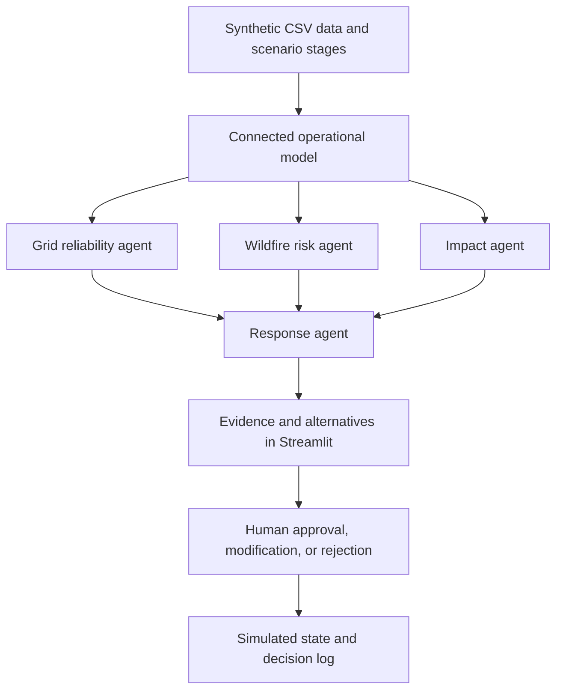

# GridGuard

**AI Grid Risk & Resilience Command Center**

GridGuard explores how a fictional California electric utility can connect grid, weather, asset, customer, and crew information to identify emerging risks and support human decisions about reliability and public safety.

**Status:** Repository organized; implementation planned. The application and datasets have not been built yet.

> GridGuard is a conceptual prototype using synthetic data. It is not a real grid-control, wildfire-prediction, or emergency-response system.

## Start here

1. [Problem decomposition](docs/GRIDGUARD_DECOMPOSITION.md): client, stakeholders, use cases, research, and interview framing.
2. [Implementation plan](docs/IMPLEMENTATION_PLAN.md): scope, architecture, build sequence, and acceptance checks.
3. [Original build brief](CODEX_BUILD_PROMPT.md): original requirements and implementation guidance.

The two supplied documents are preserved verbatim. The decomposition provides product context; the build brief provides prototype constraints; the implementation plan resolves practical details for the build.

## Problem and proposed solution

Operators must balance keeping electricity available against electrical conditions that can increase wildfire and equipment-failure risk. Information spread across separate systems makes it difficult to see where risk is emerging, who could be affected, and what response is appropriate.

The planned prototype connects those signals in a small operational model and makes the reasoning visible:

**Monitor → Detect → Investigate → Assess impact → Recommend → Human decision → Simulated action → Review outcome**

## Planned architecture



| Agent | Responsibility |
| --- | --- |
| Grid reliability | Calculate utilization and explain load and equipment anomalies. |
| Wildfire risk | Combine electrical and environmental factors into a clearly labeled prototype indicator. |
| Impact | Follow asset → circuit → customer areas / critical facilities to calculate consequences. |
| Response | Recommend allowed simulated actions and explain alternatives and tradeoffs. |

Calculations, impact counts, action eligibility, and state changes will be deterministic. Optional generative AI may explain structured findings; the full demo must also work without an API key. Template explanations will be labeled honestly.

## Repository layout

```text
Deloitte AI Demo/
├── README.md
├── CODEX_BUILD_PROMPT.md
├── .gitignore
├── docs/
│   ├── GRIDGUARD_DECOMPOSITION.md
│   └── IMPLEMENTATION_PLAN.md
├── data/README.md
├── src/README.md
└── tests/README.md
```

These directories reserve space for implementation. The plan describes the future application files; empty application stubs have not been added.

## Planned demo

Advance a synthetic day from 1:00 PM through 4:00 PM. Load and heat rise, fire-weather conditions worsen, and an asset anomaly on C-184 creates the main incident. Inspect the combined evidence and the synthetic impact of **8,420 customers and one hospital**, then approve, modify, or reject a simulated response. Review the resulting state and decision log. A short outage/restoration branch demonstrates incident response as well as prevention.

## Stack and running the app

Planned runtime dependencies: Python, Streamlit, pandas, NumPy, and Plotly. Use Python's standard `unittest` library for focused logic tests. Optional LLM support comes after the complete offline demo.

There is no runnable app yet. Once `app.py` and the dependency file are implemented, the expected local workflow is:

```sh
python3 -m venv .venv
source .venv/bin/activate
python -m pip install -r requirements.txt
python -m streamlit run app.py
```

Exact compatible versions and fresh-environment setup will be verified during implementation.

## Screenshots and demo recording

Add screenshots of the command center, incident investigation, and decision log after the working demo is verified. No screenshots or completed features are claimed at this stage.

## Limitations and roadmap

The first build uses synthetic fixtures, heuristic risk indicators, a simplified circuit model, and session-local state. It will not include real utility integrations, electrical power-flow calculations, authentication, a production database, or operational grid commands. Risk scores are not validated probabilities, and the prototype does not establish real-world safety or reliability improvements.

Build the deterministic demo first, then consider optional LLM explanations, a recorded interview walkthrough, and stronger evaluation. Production integration belongs to a separate effort.

## Research and interview preparation

The [decomposition](docs/GRIDGUARD_DECOMPOSITION.md) contains the supplied research references and interview talking points. These references are retained as provided; repository organization does not constitute independent verification of their claims. Verify public statistics against their original sources before submission. All demo measurements and client-specific numbers are synthetic.
