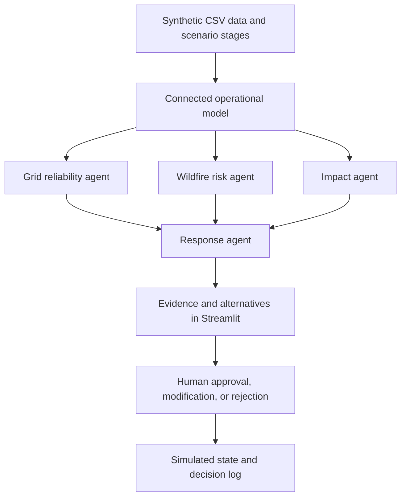

# GridGuard

**AI Grid Risk & Resilience Command Center**

GridGuard explores how a fictional California electric utility can connect grid, weather, asset, customer, and crew information to identify emerging risks and support human decisions about reliability and public safety.

**Status:** Interview-ready synthetic prototype. The Streamlit Command Center centers an investigation queue and Circuit 184 workspace, with source-labeled evidence, explicit unknowns, response options, a synthetic field-report update, geographic context, an agent data-flow graph, continuous scenario playback, evidence files, and human review controls. Phases 1–8 of the PSPS pivot are implemented and documented. The full suite has 78 passing tests. Production integrations remain future work.

> GridGuard is a conceptual prototype using synthetic data. It is not a real grid-control, wildfire-prediction, or emergency-response system.

## Start here

1. [Problem decomposition](docs/GRIDGUARD_DECOMPOSITION.md): client, stakeholders, use cases, research, and interview framing.
2. [Implementation plan](docs/IMPLEMENTATION_PLAN.md): scope, architecture, build sequence, and acceptance checks.
3. [Original build brief](CODEX_BUILD_PROMPT.md): original requirements and implementation guidance.
4. [PSPS pivot brief](docs/PSPS_PIVOT_BRIEF.md) and [pivot development plan](docs/PSPS_PIVOT_PLAN.md): proposed product direction, evidence boundaries, validation cases, and phased backlog for review.
5. [PSPS interview demo script](docs/PSPS_DEMO_SCRIPT.md): a repeatable 3–5 minute evidence-first walkthrough.

The two supplied documents are preserved verbatim. The decomposition provides product context; the build brief provides prototype constraints; the implementation plan resolves practical details for the build.

## Problem and proposed solution

Operators must balance keeping electricity available against electrical conditions that can increase wildfire and equipment-failure risk. Information spread across separate systems makes it difficult to see where risk is emerging, who could be affected, and what response is appropriate.

The planned prototype connects those signals in a small operational model and makes the reasoning visible:

**Monitor → Detect → Investigate → Assess impact → Recommend → Human decision → Simulated action → Review outcome**

In the model, `C-184` means circuit 184: a feeder responsible for a defined service
area. The circuit is the operational parent for its substation, transformer, and
distribution line, and it links to customer areas, facilities, weather zones, and
eligible crews. Other circuits have different load, temperature, and condition
trajectories, while C-184 remains the intentionally designed main incident.

## Planned architecture



| Agent | Responsibility |
| --- | --- |
| Grid reliability | Calculate utilization and explain load and equipment anomalies. |
| Wildfire risk | Combine electrical and environmental factors into a clearly labeled prototype indicator. |
| Impact | Follow asset → circuit → customer areas / critical facilities to calculate consequences. |
| Response | Recommend allowed simulated actions and explain alternatives and tradeoffs. |

Calculations, impact counts, action eligibility, and state changes will be deterministic. Optional generative AI may explain structured findings; the full demo must also work without an API key. Template explanations will be labeled honestly.

## Repository layout

```text
Deloitte AI Demo/
├── app.py                  # Streamlit Command Center
├── requirements.txt        # Tested pandas and Streamlit versions
├── README.md
├── CODEX_BUILD_PROMPT.md    # Original, unchanged
├── docs/
│   ├── GRIDGUARD_DECOMPOSITION.md  # Original, unchanged
│   └── IMPLEMENTATION_PLAN.md
├── data/                   # Six CSVs and documented units
├── src/
│   ├── __init__.py
│   ├── data_generator.py
│   ├── ontology.py
│   ├── risk_engine.py
│   ├── agents.py
│   ├── recommendations.py
│   ├── scenario.py
│   └── command_center.py    # Queue and schematic presentation helpers
└── tests/                  # Data, risk, agent, and scenario tests
```

## Planned demo

Advance a synthetic day from 1:00 PM through 4:00 PM. Load and heat rise, fire-weather conditions worsen, and an asset anomaly on C-184 creates the main incident. Inspect the combined evidence and the synthetic impact of **8,420 customers and one hospital**, then approve, modify, or reject a simulated response. Review the resulting state and decision log. A short outage/restoration branch demonstrates incident response as well as prevention.

## Setup and local verification

Verified on Python **3.14.7**, macOS arm64, with pandas **3.0.6** and Streamlit
**1.64.0**, plus Plotly **7.1.0** for the offline schematic. NumPy arrives
through pandas; optional LLM dependencies remain deferred.

From the project root:

```sh
python3 -m venv .venv
source .venv/bin/activate
python -m pip install -r requirements.txt
python -m src.data_generator
python -m unittest discover -s tests -v
python -m src.ontology
python -m src.scenario
python -m streamlit run app.py
```

Installation needs network access. Data generation, tests, the CLI scenario, and
the Command Center work without external services or API keys. Open the local URL
printed by Streamlit and use Ctrl-C to stop it. Follow the [Command Center walkthrough](docs/COMMAND_CENTER.md):
start playback, continue after each automatic pause, inspect the highest-priority incident, then Reset.

The generator defaults to seed 42. It writes 18 assets, 6 circuits, 15 weather
records (3 zones × 5 stages), 12 customer areas, 3 facilities, and 4 crews.
Use `--seed 100 --output-dir /tmp/gridguard-sample` to inspect a separate variant.
See [the data contract](data/README.md) for units, fields, and modeling assumptions.

Verified relationship: **T-882 → C-184 → 4,200 + 4,220 = 8,420 customer accounts**,
plus **F-001, Synthetic Foothill Hospital**, the only critical facility on C-184.
The facility is already included in the customer count. Impact helpers deduplicate
circuits before joining customer areas and facilities. They model circuit-wide
exposure, not detailed electrical connectivity or predicted outages.

The 78 tests verify the original data contracts plus risk boundaries, agent evidence,
weather-only behavior, incident deduplication, exact main-incident timing, reset,
and non-executing recommendations. Original source briefs remain unchanged.
UI tests also check rerun safety, stable selection, continuous slider movement, speed
controls, evidence inspection, and two complete playback/reset runs. The final prototype
includes the investigation workspace, evidence revisions, decision log, and human review
controls.

Run `python -m src.scenario` for the readable five-stage demonstration, or add
`--json` for full evidence. Read [the scoring and agent contract](docs/SCORING.md)
for weights, thresholds, and modeling decisions, and [the saved walkthrough](docs/PHASE_4_6_DEMO.md)
for sample output. At 4:00 PM, T-882 combines an electrical anomaly with 46 mph
wind and 11% humidity, producing an 88.4/100 CRITICAL combined prototype indicator.
Three overlapping category findings still expose only 8,420 accounts and one
hospital. No electricity state or crew availability changes: recommendations are
proposals that require human review and are recorded with their evidence version.

## Screenshots and demo recording

The command center, About page, evidence files, incident investigation, and decision log
are ready to demonstrate from a clean local run. Screenshots and a video can be added as
optional presentation artifacts.

## Limitations and roadmap

The first build uses synthetic fixtures centered around Santa Clarita, heuristic risk indicators, a simplified circuit model, and session-local state. It will not include real utility integrations, electrical power-flow calculations, authentication, a production database, or operational grid commands. Risk scores are not validated probabilities, and the prototype does not establish real-world safety or reliability improvements.

Build the deterministic demo first, then consider optional LLM explanations, a recorded interview walkthrough, and stronger evaluation. Production integration belongs to a separate effort.

## Research and interview preparation

The [decomposition](docs/GRIDGUARD_DECOMPOSITION.md) contains the supplied research references and interview talking points. These references are retained as provided; repository organization does not constitute independent verification of their claims. Verify public statistics against their original sources before submission. All demo measurements and client-specific numbers are synthetic.
